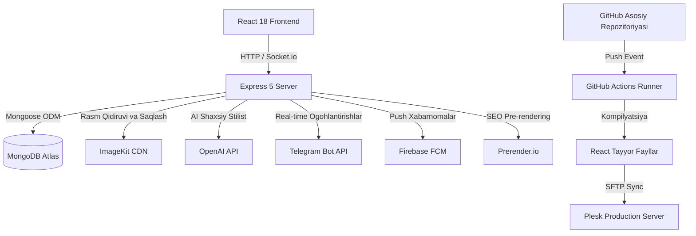

# ✨ Luxe — Premium E-commerce & Social Commerce Ekotizimi

<div align="center">

[](https://github.com/nazarovdev1/luxe_final/actions)
[](https://reactjs.org/)
[](https://nodejs.org/)
[](https://expressjs.com/)
[](https://www.mongodb.com/)
[](https://tailwindcss.com/)
[](https://www.docker.com/)
[](https://www.plesk.com/)

**Luxe** — bu ishlab chiqarish darajasidagi (production-grade), zamonaviy va mukammal elektron tijorat hamda ijtimoiy savdo platformasidir. Loyiha oddiy onlayn do'konlardan farqli o'laroq, **Sun'iy Intellekt, real vaqtdagi gamifikatsiya (sodiqlik dasturi), ijtimoiy video-tasmasi (Reels) hamda avtomatlashtirilgan Plesk CI/CD tizimlarini** o'z ichiga oladi.

[Asosiy Modullar](#-asosiy-modullar-va-imkoniyatlar) • [Tizim Arxitekturasi](#-tizim-arxitekturasi) • [API Directory](#-api-sorovlar-katalogi) • [Mahalliy Sozlash](#-mahalliy-ishga-tushirish) • [CI/CD va Plesk Deploy](#-cicd-va-plesk-deploy-tizimi)

</div>

---

## 🌟 Asosiy Modullar va Imkoniyatlar

### 🎮 1. Real-time Gamifikatsiya va Sodiqlik Dasturi
Mijozlarni jalb qilish va saqlab qolish uchun mo'ljallangan mukammal tizim:
*   **Tranzaksiyaga asoslangan Ballar Tizimi**: Foydalanuvchilarning har bir harakati (xaridlar, sharhlar, ijtimoiy ulashishlar) uchun ballar hisob-kitobini xavfsiz yuritadi.
*   **Yutuqlar va Nishonlar (Badges)**: Foydalanuvchilar ma'lum yutuqlarni bajarganda (masalan: "Doimiy Xaridor", "Top Sharhlovchi") ularga avtomatik ravishda maxsus nishonlar beriladi.
*   **Gamifikatsiyalangan Qiyinchiliklar (Challenges)**: Foydalanuvchilarga ballar va chegirma kuponlari yutib olish imkonini beruvchi davriy vazifalar.

### 🎥 2. Ijtimoiy Savdo va Kontent (Social Commerce)
Savdoni oshirish maqsadida zamonaviy ijtimoiy tarmoqlar funksiyalari integratsiya qilingan:
*   **TikTok-Style Reels**: Mahsulotlarning qisqa video-tasmasi. Ikki marta bosish orqali like bosish, ulashish va real vaqtda nested (zanjirli) izoh qoldirish imkoniyati.
*   **Socket.io orqali Live Chat xonalari**: Mijozlar va do'kon ma'murlari (adminlar) o'rtasida real vaqtda muloqot qilish uchun maxsus chat xonalari.
*   **Interaktiv Lookbook-lar va Bloglar**: Kuraorlar tomonidan mahsulotlarni vizual mavzularga guruhlash (lookbook) va foydalanuvchilar ularni bir marta bosish orqali to'plam sifatida xarid qilishlari mumkin.

### 🤖 3. Sun'iy Intellekt (AI) va Aqlli Qidiruv
Sun'iy intellekt yordamida foydalanuvchi tajribasini shaxsiylashtirish:
*   **AI Shaxsiy Stilist**: OpenAI API (GPT modellari) asosida ishlaydigan aqlli chatbot. Mijozning tavsifiga, tana tuzilishiga yoki uslubiga qarab mahsulotlarni tavsiya qiladi.
*   **Visual Search (Rasm orqali qidiruv)**: ImageKit API integratsiyasi yordamida foydalanuvchilar mahsulot rasmini yuklab, unga o'xshash mahsulotlarni vizual qidirishlari mumkin.

### 💳 4. Premium Elektron Tijorat Imkoniyatlari
*   **Kombinatsiyalangan To'plamlar (Bundles)**: Bir nechta mahsulotni bitta paket sifatida chegirmali narxda sotish tizimi.
*   **Aqlli Kuponlar**: Ma'lum muddatga ega, foydalanish soni cheklangan yoki foydalanuvchi roliga qarab ishlaydigan chegirma kodlari.
*   **Prerender.io SEO Integratsiyasi**: Search Engine (Google botlari) uchun sahifalarni production-da oldindan HTML formatga o'tkazib beradi (Lighthouse Core Web Vitals target > 80).

---

## 📐 Tizim Arxitekturasi

Quyida Luxe tizimining umumiy arxitekturasi va ma'lumotlar oqimi keltirilgan:



---

## 🛠️ Texnologiyalar (Tech Stack)

### Frontend (`/client`)
*   **React 18**: Asosiy interfeys kutubxonasi
*   **Tailwind CSS**: Tezkor va moslashuvchan styling tizimi
*   **Lucide React**: Vectorli ikonkalarni boshqarish
*   **Socket.io Client**: Real vaqtdagi ulanishlar uchun
*   **React Leaflet**: Buyurtmalarni qabul qilish punktlari xaritasi uchun

### Backend (`/server`)
*   **Node.js 22 (ESM)**: Zamonaviy ES-modules muhiti
*   **Express 5**: Yuqori tezlikdagi backend freymvorki
*   **Mongoose 8**: MongoDB uchun ODM modeli
*   **Winston**: Loglarni strukturaviy yuritish tizimi
*   **Express Rate Limit & Helmet**: Xavfsizlik va so'rovlar yuklamasini cheklash

---

## 📂 API So'rovlar Katalogi

<details>
<summary>🔑 Avtorizatsiya va Rollar (RBAC)</summary>

*   `POST /api/auth/register` - Yangi foydalanuvchi ro'yxatdan o'tkazish
*   `POST /api/auth/login` - Tizimga kirish va xavfsiz JWT olish
*   `GET /api/auth/profile` - Joriy sessiya ma'lumotlarini yuklash
*   `GET /api/auth/users` - Foydalanuvchilarni boshqarish *(Faqat Admin)*

</details>

<details>
<summary>📦 Mahsulotlar va Buyurtmalar</summary>

*   `GET /api/products` - Mahsulotlarni filtrlar bilan olish
*   `POST /api/products` - Yangi mahsulot yaratish *(Admin/Manager)*
*   `GET /api/products/:id` - Mahsulot tafsilotlarini olish
*   `POST /api/orders` - Buyurtma berish va Telegram Botga xabar yuborish
*   `GET /api/orders/all` - Barcha savdo statistikasini ko'rish *(Admin/Manager)*

</details>

<details>
<summary>🏆 Sodiqlik dasturi va Social Commerce</summary>

*   `GET /api/points` - Ballar balansi va tranzaksiyalar tarixi
*   `GET /api/badges` - Nishonlar ro'yxatini olish
*   `GET /api/challenges` - Faol topshiriqlarni yuklash
*   `GET /api/reels` - Qisqa videolar tasmasini (Reels) olish
*   `POST /api/reels/:id/comments` - Videoga izoh qoldirish

</details>

<details>
<summary>🤖 Sun'iy Intellekt (AI)</summary>

*   `POST /api/ai-stylist` - OpenAI stilisti bilan suhbatlashish
*   `POST /api/visual-search` - Rasm orqali o'xshash mahsulotlarni topish

</details>

---

## 💻 Mahalliy Ishga Tushirish

### Talablar
*   Node.js 22+
*   MongoDB bazasi (mahalliy yoki Atlas ulanishi)

### O'rnatish
1.  Repozitoriyani yuklab oling:
    ```bash
    git clone https://github.com/nazarovdev1/luxe_final.git
    cd luxe_final
    ```
2.  Kutubxonalarni o'rnating:
    ```bash
    # Asosiy dependencylarni o'rnatish
    npm install
    
    # Frontend dependencylarni o'rnatish
    cd client && npm install --legacy-peer-deps
    
    # Backend dependencylarni o'rnatish
    cd ../server && npm install
    ```
3.  Konfiguratsiyani sozlash:
    `/server` papkasi ichida `.env` faylini yarating va quyidagi o'zgaruvchilarni yozing:
    ```env
    MONGO_URL=mongodb+srv://<username>:<password>@cluster.mongodb.net/luxe
    PORT=3003
    NODE_ENV=development
    IMAGEKIT_PRIVATE_KEY=sizning_imagekit_kalitingiz
    OPENAI_API_KEY=sizning_openai_kalitingiz
    TELEGRAM_BOT_TOKEN=sizning_bot_tokeningiz
    TELEGRAM_CHAT_ID=sizning_chat_idingiz
    ```
4.  Loyihani ishga tushiring:
    ```bash
    # Serverni ishga tushirish (/server papkasidan)
    npm run dev
    
    # Clientni ishga tushirish (/client papkasidan)
    npm start
    ```

---

## 🚀 CI/CD va Plesk Deploy Tizimi

Luxe loyihasi GitHub Actions orqali **Plesk Panel (Phusion Passenger muhiti)** bilan to'liq avtomatlashtirilgan.

### Deploy Qadamlari
Har safar `main` branchiga yangi kod yuborilganda (push bo'lganda), GitHub Actions:
1.  **Kod tekshiruvi**: Backend fayllari sintaksisini tekshiradi.
2.  **Frontend Build**: React loyihani production uchun kompilyatsiya qiladi.
3.  **Fayllarni ko'chirish**: Hosil bo'lgan build fayllarini `server/public/` papkasiga ko'chiradi.
4.  **Passenger Restart**: Loyihada `server/tmp/restart.txt` faylini yangilaydi (Plesk server buni ko'rib dasturni avtomatik restart qiladi).
5.  **SFTP Sync**: `wlixcc/SFTP-Deploy-Action` yordamida barcha production fayllarni serverdagi `/server` papkasiga yuklaydi (`node_modules` yuklanmasdan tezkor rsync qilinadi).

### Plesk Paneldagi Sozlamalar
*   **Application Root**: `/server`
*   **Document Root**: `/server/public`
*   **Application Startup File**: `server.js`
*   **NPM Dependency**: Loyiha birinchi marta yuklangandan so'ng Plesk-da Node.js bo'limiga kirib **"NPM Install"** tugmasini bosing.
*   **Environment variables**: `/server/.env` fayliga production uchun mo'ljallangan kalitlarni kiriting.