# 🏆 Luxx.uz — Premium Fashion E-commerce Loyiha Hisoboti

**Sana:** 2026-yil 30-Aprel  
**Loyiha:** Luxx.uz — Premium ayollar fashion e-commerce do'koni  
**Texnologiyalar:** React 18, Tailwind CSS, Express.js 5, MongoDB, Node.js  

---

## 📋 Umumiy Ma'lumot

Ushbu hisobotda Luxx.uz loyihasiga chet elda mavjud bo'lib, O'zbekistonda yo'q bo'lgan **22 ta premium funksiya** qo'shildi. Barcha funksiyalar 5 bosqichda (Phase) professional tarzda amalga oshirildi. Har bir funksiya loyihaning mavjud dizayn tizimiga (qorong'u tema, oltin aksent rang `#d6b47c`, `rounded-[2rem]` kartalar) to'liq moslashtirildi.

### Bosqichlar jadvali:

| Bosqich | Funksiyalar soni | Holat |
|---------|-------------------|-------|
| Phase 1 | 5 ta | ✅ Bajarildi |
| Phase 2 | 5 ta | ✅ Bajarildi |
| Phase 3 | 5 ta | ✅ Bajarildi |
| Phase 4 | 5 ta | ✅ Bajarildi |
| Phase 5 | 2 ta | ✅ Bajarildi |
| **Jami:** | **22 ta** | **✅ Barchasi bajarildi** |

---

## 🔧 PHASE 1 — Asosiy Qulayliklar

### 1. 📏 O'lcham Jadvali (Size Guide Modal)

**Fayl:** `client/src/components/SizeGuideModal.js`  
**Integratsiya:** `client/src/pages/ProductView.js`

**Tavsif:** Mahsulot sahifasida o'lcham jadvali modal oynasi. Foydalanuvchi o'z o'lchamlarini kiritib, mos keladigan o'lchamni topishi mumkin.

**Asosiy xususiyatlari:**
- 3 ta kategoriya bo'yicha o'lcham jadvallari: Ko'ylaklar, Shimlar/Jubkalar, Poyabzallar
- Interaktiv o'lcham kalkulyatori — bo'y, vazn, ko'krak aylanasini kiritish orqali mos o'lchamni tavsiya qilish
- "Qanday o'lchash" qo'llanmasi — har bir o'lchamni qanday to'g'ri o'lchash kerakligi haqida ko'rsatmalar
- Chiroyli tab-li interfeys, mavjud dizayn bilan mos

---

### 2. 👁 Yaqinda Ko'rilgan (Recently Viewed)

**Fayllar:**
- `client/src/hooks/useRecentlyViewed.js` — Custom React Hook
- `client/src/components/RecentlyViewed.js` — Komponent

**Integratsiya:** `client/src/pages/Home.js`

**Tavsif:** Foydalanuvchi ko'rgan mahsulotlarni saqlab, bosh sahifada ko'rsatadi.

**Asosiy xususiyatlari:**
- `localStorage`'da so'nggi 20 ta mahsulotni saqlaydi
- Cross-tab sinxronizatsiya — boshqa tabda ko'rilgan mahsulotlar ham yangilanadi
- Gorizontal aylanuvchi grid dizayni
- Custom Hook sifatida implementatsiya qilingan — boshqa komponentlarda ham qayta ishlatish mumkin

---

### 3. ⚡ Tez Ko'rish (Quick View Modal)

**Fayl:** `client/src/components/QuickViewModal.js`  
**Integratsiya:** `client/src/pages/AllProducts.js`

**Tavsif:** Katalog sahifasida mahsulot kartasini bosganda to'liq ma'lumotlarni ko'rish imkonini beradi, sahifani tark etmasdan.

**Asosiy xususiyatlari:**
- Rasm karuseli — bir nechta rasmlarni ko'rish
- Rang va o'lcham tanlash
- Miqdor tanlash va savatga qo'shish
- Mahsulot narxi, chegirmasi, tavsifi
- Modal oyna sifatida ochiladi — sahifadan chiqmasdan

---

### 4. 🎁 Sovg'a Qadoqlash (Gift Wrapping)

**Fayl:** `client/src/pages/Checkout.js` (modifikatsiya)  
**Integratsiya:** Buyurtma jarayonida 2-qadamda ko'rsatiladi

**Tavsif:** Buyurtmani sovg'a qadoqlash xizmati bilan buyurtma qilish imkoniyati.

**Asosiy xususiyatlari:**
- 3 ta qadoqlash turi: Oddiy (15,000 so'm), Premium (25,000 so'm), Lyuks (40,000 so'm)
- Har bir turning o'z ikonkasi va rangi
- Qadoqlash narxi buyurtma umumiy summasiga avtomatik qo'shiladi
- Buyurtma ma'lumotlarida `giftWrap` maydoni sifatida serverga yuboriladi

---

### 5. 🔍 Kengaytirilgan Filtrlash (Advanced Filtering)

**Fayl:** `client/src/pages/AllProducts.js` (modifikatsiya)

**Tavsif:** Mahsulotlar katalogida professional filtrlash paneli.

**Asosiy xususiyatlari:**
- Narx oralig'i filtri — minimal va maksimal narxni kiritish
- O'lcham filtri — bir nechta o'lchamni tanlash (XS, S, M, L, XL, XXL)
- Reyting filtri — yulduzlar soni bo'yicha
- Faqat mavjud mahsulotlar filtri
- Aktiv filtrlar sonini ko'rsatish
- "Filtrlarni tozalash" tugmasi

---

## 🔧 PHASE 2 — Sotuv va To'lov Qulayliklari

### 6. 💳 Nasiya Kalkulyatori (Installment Calculator)

**Fayl:** `client/src/components/InstallmentCalculator.js`  
**Integratsiya:** `client/src/pages/ProductView.js`

**Tavsif:** Mahsulotni nasiyaga sotib olish kalkulyatori. 3 ta O'zbekiston nasiya provayderini qo'llab-quvvatlaydi.

**Asosiy xususiyatlari:**
- **Uzum Nasiya** — 0% dan 10% gacha, 3/6/12 oy
- **Zoloto** — 3% dan 14% gacha, 3/6/12 oy
- **Humo** — 0% dan 8% gacha, 3/6/12 oy
- Oylik to'lovni avtomatik hisoblash
- Provayderlar orasida almashish imkoniyati
- Jami ortiqcha to'lov miqdorini ko'rsatish

---

### 7. 📦 Mahsulot To'plamlari (Product Bundles)

**Fayl:** `client/src/components/ProductBundles.js`  
**Integratsiya:** `client/src/pages/Home.js`

**Tavsif:** Bir nechta mahsulotni chegirma bilan birga sotib olish imkoniyati.

**Asosiy xususiyatlari:**
- Demo to'plamlar: "Kuzgi Glamur", "Ofis Chic", "Maxsus Kech"
- 12-15% gacha chegirma
- To'plamdagi barcha mahsulotlarni bir tugma bilan savatga qo'shish
- Har bir to'plamda 3 ta mahsulot ko'rsatiladi
- Gorizontal scroll dizayni

---

### 8. 🎴 Sovg'a Kartalari (Gift Cards)

**Fayl:** `client/src/pages/GiftCards.js`  
**Route:** `/gift-cards`  
**Integratsiya:** `client/src/App.js` (route), `client/src/components/Navbar.js` (menyu)

**Tavsif:** Sovg'a kartalari sotib olish sahifasi. To'liq mustaqil sahifa.

**Asosiy xususiyatlari:**
- 6 ta oldindan belgilangan summa: 50K, 100K, 200K, 300K, 500K, 1,000,000 so'm
- Maxsus summa kiritish imkoniyati
- 4 ta karta dizayni: Tug'ilgan kun, Nikoh, Yangi yil, Umumiy
- Promo kod generatsiyasi
- Qabul qiluvchi ismi va tabrik matni
- Navbar'dagi "EVENTLAR" menyusiga qo'shilgan

---

### 9. ⏰ Flash Sale Taymer (Chegirma Taymeri)

**Fayl:** `client/src/components/FlashSaleTimer.js`  
**Integratsiya:** `client/src/pages/ProductView.js`

**Tavsif:** Chegirmali mahsulotlar uchun haqiqiy vaqtda teskari hisoblash taymeri.

**Asosiy xususiyatlari:**
- Kun, soat, daqiqa, soniya ko'rsatkichlari
- Qolgan mahsulot soni progress bar
- "Chegirma tugashiga X soat" degan ogohlantirish
- Animatsiyali raqamlar
- Mavjud dizayn bilan moslashtirilgan

---

### 10. 🔔 Qayta Sotuvga Chiqdi (Back in Stock Button)

**Fayl:** `client/src/components/BackInStockButton.js`  
**Integratsiya:** `client/src/pages/ProductView.js`

**Tavsif:** Tugagan mahsulot uchun ogohlantirish o'rnatish. Mahsulot qayta paydo bo'lganda xabar keladi.

**Asosiy xususiyatlari:**
- 2 ta xabar usuli: SMS va Push-bildirish
- Telefon raqam kiritish
- "Meni xabardor qiling" tugmasi
- Muvaffaqiyatli ro'yxatdan o'tish tasdig'i
- Server API ga tayyor (hozirda simulated)

---

## 🔧 PHASE 3 — Buyurtma va Hisob Boshqaruvi

### 11. 📊 Buyurtma Kuzatish (Order Timeline)

**Fayl:** `client/src/components/OrderTimeline.js`  
**Integratsiya:** `client/src/pages/Profile.js`

**Tavsif:** Buyurtma holatini vizual timeline ko'rinishida kuzatish.

**Asosiy xususiyatlari:**
- 4 ta holat: Kutilmoqda → Jarayonda → Yetkazilmoqda → Yetkazildi
- Har bir holat o'z rangi va ikonkasi bilan
- Vaqt belgilari — har bir holat o'zgargan sana
- Progress bar bilan vizual ko'rsatish
- Modal oyna sifatida ochiladi

---

### 12. 🔄 Qaytarish So'rovi (Return Request Modal)

**Fayl:** `client/src/components/ReturnRequestModal.js`  
**Integratsiya:** `client/src/pages/Profile.js`

**Tavsif:** Buyurtmani qaytarish uchun 4 qadamli jarayon.

**Asosiy xususiyatlari:**
- **1-qadam:** Qaytariladigan mahsulotlarni tanlash
- **2-qadam:** Sabab tanlash (O'lcham mos kelmadi, Rang farq qildi, Sifat yoqmad, Boshqa)
- **3-qadam:** Qaytarish turi (Pul qaytarish, Almashish)
- **4-qadam:** Tasdiqlash va izoh qoldirish
- 14 kunlik qaytarish oynasi validatsiyasi
- Har bir qadamda progress ko'rsatkich

---

### 13. 📉 Narx Tushish Ogohlantirish (Price Drop Alert)

**Fayl:** `client/src/components/PriceDropAlert.js`  
**Integratsiya:** `client/src/pages/ProductView.js`

**Tavsif:** Mahsulot narxi ma'lum darajaga tushganda ogohlantirish olish.

**Asosiy xususiyatlari:**
- Maqsad narxni qo'lda kiritish
- Tez tanlash tugmalari: -10%, -15%, -20%, -30%
- 3 ta xabar usuli: Email, SMS, Push-bildirish
- Joriy narx bilan maqsad narx farqini ko'rsatish
- Modal oyna sifatida ochiladi

---

### 14. 📅 Rejalashtirilgan Yetkazib Berish (Scheduled Delivery)

**Fayl:** `client/src/pages/Checkout.js` (modifikatsiya)  
**Integratsiya:** Buyurtma 3-qadamida

**Tavsif:** Yetkazib berish sanasi va vaqtini oldindan tanlash imkoniyati.

**Asosiy xususiyatlari:**
- Sana tanlash kalendari
- 5 ta vaqt oralig'i: 09:00-12:00, 12:00-15:00, 15:00-18:00, 18:00-21:00, 21:00-23:00
- Express yetkazib berish — 25,000 so'm qo'shimcha to'lov bilan
- Ertasi kun yetkazib berish imkoniyati
- Buyurtma ma'lumotlarida `scheduledDelivery` maydoni sifatida serverga yuboriladi

---

### 15. 🌐 Ijtimoiy Tarmoq orqali Kirish (Social Login)

**Fayl:** `client/src/components/LoginForm.js` (modifikatsiya)

**Tavsif:** Login sahifasida ijtimoiy tarmoqlar orqali kirish tugmalari.

**Asosiy xususiyatlari:**
- **Telegram** orqali kirish
- **Google** orqali kirish
- **SMS OTP** orqali kirish (O'zbekiston uchun eng muhimi)
- Har bir tugma o'z rangi va ikonkasi bilan
- Ajratuvchi chiziq "yoki" matni bilan
- OAuth integratsiyasiga tayyor frontend

---

## 🔧 PHASE 4 — Ijtimoiy va Marketing

### 16. 👥 Taklif Dasturi (Referral Program)

**Fayl:** `client/src/components/ReferralProgram.js`  
**Integratsiya:** `client/src/pages/Profile.js`

**Tavsif:** Do'stlarni taklif qilib bonus olish imkoniyati.

**Asosiy xususiyatlari:**
- Unikal taklif havolasi generatsiyasi
- Ulashish tugmalari: Telegram, WhatsApp, Instagram
- Statistika paneli: Taklif qilinganlar soni, Olingan bonuslar, Konversiya darajasi
- Taklif tarixi ro'yxati
- Har bir taklif uchun 10,000 so'm bonus

---

### 17. 📸 Mijozlar Foto Sharhlar (Customer Photo Reviews)

**Fayl:** `client/src/components/CustomerPhotoReviews.js`  
**Integratsiya:** `client/src/pages/ProductView.js`

**Tavsif:** Mijozlar o'zlarining mahsulot bilan rasmlarini yuklab, sharh qoldirishlari mumkin.

**Asosiy xususiyatlari:**
- Instagram uslubidagi foto grid
- Rasm yuklash modal oynasi
- Like bosish tizimi
- Har bir foto sharh uchun +15 ball bonus
- Foydalanuvchi avatari va ismi ko'rsatiladi
- "Barcha sharhlarni ko'rish" tugmasi

---

### 18. 💝 Sevimlilarni Ulashish (Wishlist Sharing)

**Fayl:** `client/src/components/WishlistShare.js`

**Tavsif:** Sevimli mahsulotlar ro'yxatini do'stlar bilan baham ko'rish.

**Asosiy xususiyatlari:**
- Sevimlilar ro'yxatini chiroyli ko'rinishda ulashish
- Sovg'a ro'yxati rejimi — "Menga sovg'a qiling" funksiyasi
- Mini mahsulot grid preview
- Havola nusxalash tugmasi
- Ijtimoiy tarmoqlarda ulashish

---

### 19. 📝 Fashion Blog

**Fayl:** `client/src/pages/Blog.js`  
**Route:** `/blog`  
**Integratsiya:** `client/src/App.js` (route), `client/src/components/Navbar.js` (menyu)

**Tavsif:** To'liq fashion blog sahifasi. Maqolalar, stil maslahatlari, yangiliklar.

**Asosiy xususiyatlari:**
- 6 ta demo maqola: Stil maslahatlari, Trendlar, Kuzatuv, Intervyu
- Kategoriya filtri: Stil, Trendlar, Kuzatuv, Lifestyle
- Qidiruv funksiyasi
- Tavsiya etilgan maqola (featured post) — katta rasm bilan
- O'qish davomiyligi ko'rsatkichlari
- Navbar'dagi "EVENTLAR" menyusiga qo'shilgan

---

### 20. 🎨 Stil So'rovlari (Style Polls)

**Fayl:** `client/src/components/StylePolls.js`  
**Integratsiya:** `client/src/pages/StyleFeed.js`

**Tavsif:** Foydalanuvchilar o'rtasida interaktiv stil so'rovlari va ovoz berish.

**Asosiy xususiyatlari:**
- Rasm solishtirish asosidagi so'rovlar
- Ovoz berish va natijalarni foizda ko'rish
- Progress bar bilan vizual natijalar
- Jami ovozlar soni ko'rsatkichi
- Style Feed sahifasiga integratsiya qilingan

---

## 🔧 PHASE 5 — Global Qulayliklar

### 21. 🌍 Ko'p Tilli Tizim (Multi-Language System)

**Fayllar:**
- `client/src/contexts/LanguageContext.js` — Context va Provider
- `client/src/data/translations.js` — Tarjimalar lug'ati (UZ/RU/EN)
- `client/src/components/Navbar.js` (modifikatsiya) — Til almashtirgich

**Integratsiya:** `client/src/App.js` — LanguageProvider barcha providerlarni o'rab turadi

**Tavsif:** Saytni 3 tilda ko'rish imkoniyati: O'zbek, Rus, Ingliz.

**Asosiy xususiyatlari:**
- 3 ta til: 🇺🇿 O'zbek, 🇷🇺 Русский, 🇬🇧 English
- `t('key.subkey')` funksiyasi orqali tarjima
- `localStorage`'da tanlangan tilni saqlash
- Navbar'da Globe ikonkali til almashtirgich
- Dropdown menyu orqali til tanlash
- O'zbek tili standart til sifatida
- To'liq tarjima lug'atlari: navigatsiya, umumiy, mahsulot, savat, buyurtma, autentifikatsiya, profil, bosh sahifa, footer

---

### 22. ⚖️ Mahsulot Taqqoslash (Product Comparison)

**Fayl:** `client/src/components/ProductComparison.js`  
**Integratsiya:** `client/src/pages/AllProducts.js`

**Tavsif:** 2-3 ta mahsulotni yonma-yon taqqoslash imkoniyati.

**Asosiy xususiyatlari:**
- Mahsulot kartasida "Taqqoslash" tugmasi
- Taqqoslash paneli (pastda) — tanlangan mahsulotlar soni ko'rsatiladi
- Taqqoslash modal oynasi — to'liq jadval ko'rinishida
- Dinamik grid — 2 yoki 3 mahsulot uchun moslashadi
- Taqqoslash qatorlari: Narx, Brend, O'lchamlar, Ranglar, Reyting, Mavjudlik
- "Eng yaxshi" indikatori — eng yaxshi ko'rsatkichga ega mahsulot belgilanadi
- Taqqoslash ro'yxatini tozalash tugmasi

---

## 📁 Yaratilgan Fayllar Ro'yxati

### Yangi Komponentlar (17 ta fayl):

| # | Fayl yo'li | Tavsif |
|---|-----------|--------|
| 1 | `client/src/components/SizeGuideModal.js` | O'lcham jadvali |
| 2 | `client/src/hooks/useRecentlyViewed.js` | Yaqinda ko'rilgan hook |
| 3 | `client/src/components/RecentlyViewed.js` | Yaqinda ko'rilgan komponent |
| 4 | `client/src/components/QuickViewModal.js` | Tez ko'rish modal |
| 5 | `client/src/components/InstallmentCalculator.js` | Nasiya kalkulyatori |
| 6 | `client/src/components/ProductBundles.js` | Mahsulot to'plamlari |
| 7 | `client/src/pages/GiftCards.js` | Sovg'a kartalari sahifasi |
| 8 | `client/src/components/FlashSaleTimer.js` | Flash sale taymer |
| 9 | `client/src/components/BackInStockButton.js` | Qayta sotuvga chiqdi |
| 10 | `client/src/components/OrderTimeline.js` | Buyurtma kuzatish |
| 11 | `client/src/components/ReturnRequestModal.js` | Qaytarish so'rovi |
| 12 | `client/src/components/PriceDropAlert.js` | Narx tushish ogohlantirish |
| 13 | `client/src/components/ReferralProgram.js` | Taklif dasturi |
| 14 | `client/src/components/CustomerPhotoReviews.js` | Mijozlar foto sharhlar |
| 15 | `client/src/components/WishlistShare.js` | Sevimlilarni ulashish |
| 16 | `client/src/pages/Blog.js` | Fashion blog sahifasi |
| 17 | `client/src/components/StylePolls.js` | Stil so'rovlari |

### Yangi Infrastruktura Fayllari (3 ta):

| # | Fayl yo'li | Tavsif |
|---|-----------|--------|
| 18 | `client/src/contexts/LanguageContext.js` | Til konteksti va provider |
| 19 | `client/src/data/translations.js` | Tarjimalar lug'ati (UZ/RU/EN) |
| 20 | `client/src/components/ProductComparison.js` | Mahsulot taqqoslash |

### O'zgartirilgan Fayllar (10 ta):

| # | Fayl yo'li | Qo'shilgan funksiyalar |
|---|-----------|------------------------|
| 1 | `client/src/pages/ProductView.js` | SizeGuideModal, useRecentlyViewed, InstallmentCalculator, FlashSaleTimer, BackInStockButton, PriceDropAlert, CustomerPhotoReviews |
| 2 | `client/src/pages/Home.js` | ProductBundles, RecentlyViewed |
| 3 | `client/src/pages/AllProducts.js` | QuickViewModal, Advanced Filtering, ProductComparison |
| 4 | `client/src/pages/Checkout.js` | Gift Wrapping, Scheduled Delivery, Express fee |
| 5 | `client/src/App.js` | GiftCards route, Blog route, LanguageProvider |
| 6 | `client/src/components/Navbar.js` | Blog/GiftCards menyu, LanguageSwitcher |
| 7 | `client/src/pages/Profile.js` | OrderTimeline, ReturnRequestModal, ReferralProgram |
| 8 | `client/src/components/LoginForm.js` | Telegram, Google, SMS OTP tugmalari |
| 9 | `client/src/pages/StyleFeed.js` | StylePolls integratsiyasi |
| 10 | `client/src/components/Navbar.js` | Til almashtirgich (LanguageSwitcher) |

---

## 🏗️ Arxitektura Diagrammasi

```mermaid
graph TB
    subgraph Providers
        LP[LanguageProvider]
        AP[AuthProvider]
        CP[CartContext]
        FP[FavoritesContext]
        PP[ProductContext]
        NP[NotificationContext]
    end

    subgraph New Pages
        GC[GiftCards Page]
        BL[Blog Page]
    end

    subgraph New Components
        SGM[SizeGuideModal]
        RV[RecentlyViewed]
        QVM[QuickViewModal]
        IC[InstallmentCalculator]
        PB[ProductBundles]
        FST[FlashSaleTimer]
        BIS[BackInStockButton]
        OT[OrderTimeline]
        RRM[ReturnRequestModal]
        PDA[PriceDropAlert]
        RP[ReferralProgram]
        CPR[CustomerPhotoReviews]
        WS[WishlistShare]
        SP[StylePolls]
        PC[ProductComparison]
        LS[LanguageSwitcher]
    end

    subgraph Modified Pages
        PV[ProductView]
        HM[Home]
        ALP[AllProducts]
        CH[Checkout]
        PR[Profile]
        LF[LoginForm]
        SF[StyleFeed]
    end

    LP --> LS
    LP --> PV
    LP --> HM
    LP --> ALP

    PV --> SGM
    PV --> IC
    PV --> FST
    PV --> BIS
    PV --> PDA
    PV --> CPR

    HM --> PB
    HM --> RV

    ALP --> QVM
    ALP --> PC

    CH -->|Gift Wrap| CH
    CH -->|Scheduled Delivery| CH

    PR --> OT
    PR --> RRM
    PR --> RP

    LF -->|Social Login| LF
    SF --> SP
```

---

## 🎨 Dizayn Tamoyillari

Barcha yangi komponentlar quyidagi dizayn standartlariga amal qilgan:

| Element | Qiymat |
|---------|--------|
| Asosiy fon | `#07080c` |
| Karta foni | `#11131e` |
| Oltin aksent | `#d6b47c` |
| Kartalar radiusi | `rounded-[2rem]` |
| Matn rangi | `text-white`, `text-white/60` |
| Hover effektlari | `hover:bg-white/10`, `transition-all` |
| Modal overlay | `bg-black/60 backdrop-blur-sm` |
| Tugmalar | `bg-[#d6b47c] text-black font-semibold` |

---

## 📊 Statistika

| Ko'rsatkich | Qiymat |
|-------------|--------|
| Yaratilgan yangi fayllar | 20 ta |
| O'zgartirilgan fayllar | 10 ta |
| Jami funksiyalar | 22 ta |
| Implementatsiya bosqichlari | 5 ta |
| Qo'llab-quvvatlanadigan tillar | 3 ta (UZ, RU, EN) |
| Nasiya provayderlari | 3 ta (Uzum, Zoloto, Humo) |
| Sovg'a karta dizaynlari | 4 ta |
| Qaytarish sabablari | 4 ta |
| Yetkazib berish vaqtlari | 5 ta |

---

