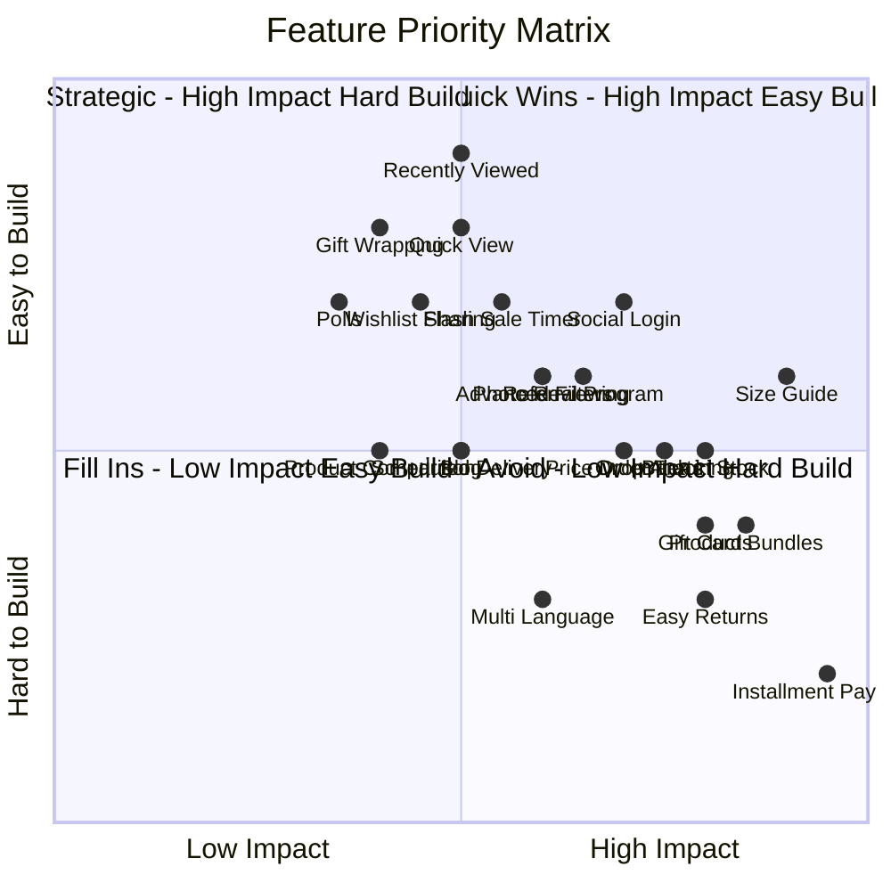

# 🛍️ LUXE — Premium Fashion E-Commerce: Yangi Qulayliklar Rejalasi

## 📋 Loyihaning Hozirgi Holati (Mavjud Funksiyalar)

Loyihada quyidagi funksiyalar **allaqachon mavjud**:

| # | Funksiya | Status |
|---|----------|--------|
| 1 | Mahsulot katalogi - Premium/Luxury/Corporate/Limited | ✅ |
| 2 | Savat va Checkout - Leaflet xarita bilan | ✅ |
| 3 | To'lov - Naqd/Click/Payme | ✅ |
| 4 | Ro'yxatdan o'tish - Telefon raqam bilan | ✅ |
| 5 | Profil - Buyurtmalar tarixi, badge, ballar | ✅ |
| 6 | VIP Club - Bronze/Silver/Gold/Diamond | ✅ |
| 7 | Style Feed - Ijtimoiy tarmoq | ✅ |
| 8 | Reels - Qisqa videolar | ✅ |
| 9 | Lookbook Builder - Kiyim kombinatsiyasi yaratish | ✅ |
| 10 | Challenges - Style musobaqalari | ✅ |
| 11 | Live Streams - YouTube efirlar | ✅ |
| 12 | AI Stylist Chat | ✅ |
| 13 | Visual Search - Rasm bilan qidirish | ✅ |
| 14 | Eco Impact - Ekologik hisob-kitob | ✅ |
| 15 | Telegram bot - Buyurtma bildirishnomalari | ✅ |
| 16 | SMS xizmati | ✅ |
| 17 | Push bildirishnomalar - FCM | ✅ |
| 18 | PWA - Offlayn qo'llab-quvvatlash | ✅ |
| 19 | Mobil versiya - Alohida mobile routelar | ✅ |
| 20 | SEO optimallashtirish | ✅ |
| 21 | Admin panel - To'liq boshqaruv | ✅ |
| 22 | Kuponlar va Promokodlar | ✅ |
| 23 | Sevimlilar - Wishlist | ✅ |
| 24 | Sharhlar - Reviews | ✅ |

---

## 🚀 TAVSIYA ETILAYOTGAN YANGI FUNKSIYALAR

### 🔴 1-CHI DARAJALI — Daromad va Konversiyani Oshirish

#### 1. Nasiya / Bo'lib To'lash Tizimi
**Muammo:** O'zbekistonda premium kiyim narxi yuqori. Ko'p xaridorlar biryo'la to'lay olmaydi.
**Yechim:** Uzum Bo'lib To'lash, Zoloto, Humo nasiya integratsiyasi.

```
Frontend:
- Checkout sahifada "Bo'lib to'lash" option
- Nasiya kalkulyatori - 3/6/12 oyga bo'lish
- Oylik to'lov miqdorini ko'rsatish

Backend:
- Payment provider API integratsiya
- Nasiya statusini kuzatish
- SMS bilan to'lov eslatmalari
```

**Foyda:** Konversiya 30-50% oshadi. O'zbekistonda Uzum Pay juda mashhur.

---

#### 2. O'lcham Yo'riqnoma Tizimi - Size Guide
**Muammo:** Online kiyim sotib olayotganda eng katta muammo - o'lcham noto'g'ri tanlash.
**Yechim:** Batafsil o'lcham jadvali va "Mening O'lchamimni Top" funksiyasi.

```
Frontend:
- Har bir mahsulotda "O'lcham jadvali" tugmasi
- Interaktiv o'lcham kalkulyatori:
  * Bo'yi, vazni, ko'kragi, belini kiritish
  * Tavsiya etilgan o'lchamni ko'rsatish
- CM va INCH o'rtasida almashtirish
- Har bir kategoriya uchun alohida jadval

Backend:
- Size recommendation algoritmi
- O'lcham ma'lumotlarini saqlash
```

**Foyda:** Qaytarishlar 40% kamayadi. Xaridor ishonchi oshadi.

---

#### 3. Qayta Sotuvga Chiqdi Bildirishnomasi - Back in Stock Alerts
**Muammo:** Tugagan mahsulotlar uchun xaridorlar qayta kelishadi lekin bilisholmaydi.
**Yechim:** Tugagan mahsulotlar uchun "Bildirishnoma olish" tugmasi.

```
Frontend:
- Mahsulot sahifada "Qachon paydo bo'lishini bilish" tugmasi
- Profil sahifada kutilayotgan bildirishnomalar ro'yxati
- Modal oyna - email yoki telefon raqam kiritish

Backend:
- Notification queue tizimi
- Mahsulot stock yangilanganda avtomatik SMS/Push yuborish
- Email bildirishnomalari
```

**Foyda:** Sotuvdan tushgan daromadni qaytarish. Mijozlarni ushlab qolish.

---

#### 4. Narx Tushdi Bildirishnomasi - Price Drop Alerts
**Muammo:** Xaridorlar narx tushishini kutishadi lekin tekshirib yurishadi.
**Yechim:** Sevimli mahsulotlar narxi tushganda avtomatik bildirishnoma.

```
Frontend:
- Sevimlilar sahifada narx o'zgarish ko'rsatkichi
- Narx kuzatish tugmasi - "Narx tushsa xabar ber"
- Narx tarixi grafigi

Backend:
- Cron job - har soatda narxlarni tekshirish
- Narx tushganda push/SMS yuborish
- Price history model
```

---

#### 5. Sovg'a Kartalari - Gift Cards
**Muammo:** Odamlar sovg'a olishda qiynaladi. Premium kiyim sovg'a qilish qiyin.
**Yechim:** Raqamli sovg'a kartalari.

```
Frontend:
- Gift Card sahifasi - summni tanlash (100k, 200k, 500k, maxsus)
- Chiroyli dizayn bilan sovg'a kartasi
- Email yoki Telegram orqali yuborish
- Promo kod formatida

Backend:
- Gift Card model - kod, balans, faollik
- Checkout da gift card ni qo'llash
- Balansni tekshirish
```

---

#### 6. Mahsulot To'plamlari - Product Bundles / Buy the Look
**Muammo:** Xaridorlar faqat bitta narsa sotib oladi, to'liq look olishni o'ylamaydi.
**Yechim:** "To'liq ko'rinishni xarid qilish" - bir nechta mahsulotni chegirma bilan.

```
Frontend:
- Mahsulot sahifada "Bu ko'rinishni tugatish" bo'limi
- Bundle narxi va chegirmasi ko'rsatish
- "Hammasini savatga qo'shish" tugmasi

Backend:
- Bundle model - mahsulotlar, chegirma foizi
- Bundle narxini hisoblash
- Admin da bundle yaratish
```

**Foyda:** O'rtacha buyurtma qiymati 40-60% oshadi.

---

### 🟡 2-CHI DARAJALI — UX va Qulaylik

#### 7. So'nggi Ko'rilgan Mahsulotlar - Recently Viewed
```
Frontend:
- Home va Products sahifada "So'nggi ko'rilganlar" karusel
- localStorage va DB da saqlash
- Mobile versiyada ham ko'rsatish
```

---

#### 8. Tezkor Ko'rish - Quick View Modal
```
Frontend:
- Mahsulot kartasida hover qilganda "Tezkor ko'rish" tugmasi
- Modal oyna - rasm, narx, o'lcham tanlash, savatga qo'shish
- Sahifani tark etmasdan mahsulotni ko'rish
```

---

#### 9. Buyurtma Kuzatish Tizimi - Order Tracking
**Muammo:** Xaridorlar buyurtma holatini bilish uchun qo'ng'iroq qilishadi.
**Yechim:** Real-time buyurtma kuzatish.

```
Frontend:
- Profil sahifada buyurtma holati timeline
- Har bir status o'zgarishida visual ko'rsatkich:
  Kutilmoqda → Tasdiqlandi → Jarayonda → Yetkazilmoqda → Yetkazildi
- Buyurtma ID bilan qidirish

Backend:
- Order status cron job - avtomatik yangilash
- Har bir status o'zgarganda SMS/Push yuborish
- ETA hisoblash
```

---

#### 10. Oson Qaytarish/Almashtirish Tizimi
**Muammo:** Online kiyimda qaytarish asosiy muammo. Ishonch yo'q.
**Yechim:** Bir tugma bilan qaytarish so'rovi.

```
Frontend:
- Buyurtma detalida "Qaytarish" tugmasi
- Qaytarish sababi tanlash:
  * O'lcham mos kelmadi
  * Rang farq qildi
  * Sifat mamnun qilmadi
  * Boshqa
- O'lcham almashtirish optioni

Backend:
- Return request model
- Admin da return boshqarish
- Courier chaqirish integratsiya
- Avtomatik refund yoki almashtirish
```

---

#### 11. Sovg'a Qadoqlash - Gift Wrapping
```
Frontend:
- Checkout da "Sovg'a qadoqlash" option
- Qadoqlash turi tanlash - klassik, premium, maxsus
- Shaxsiy maktub qo'shish
- Qadoqlash narxini qo'shish

Backend:
- Order model ga giftWrap maydoni qo'shish
- Admin da qadoqlash ma'lumotini ko'rish
```

---

#### 12. Rejalashtirilgan Yetkazib Berish - Scheduled Delivery
```
Frontend:
- Checkout da sana va vaqt tanlash
- Mavjud vaqtlar ro'yxati
- Ertasi kun / 2 kun keyin optionlari

Backend:
- Delivery slots model
- Kunlik slot limiti
- Admin da delivery schedule boshqarish
```

---

#### 13. Ijtimoiy Kirish - Social Login
**Muammo:** Ro'yxatdan o'tish uzoq. Telefon+parol eslab qolish kerak.
**Yechim:** Telegram va Google orqali tezkor kirish.

```
Frontend:
- Login sahifada "Telegram orqali kirish" tugmasi
- "Google orqali kirish" tugmasi
- One-tap auth

Backend:
- Telegram OAuth integratsiya
- Google OAuth integratsiya
- Account linking - telefon bilan bog'lash
```

**Foyda:** O'zbekistonda Telegram eng mashhur. Ro'yxatdan o'tish konversiyasi 50% oshadi.

---

### 🟢 3-CHI DARAJALI — Jamiyat va Engagement

#### 14. Taklif Dasturi - Referral Program
```
Frontend:
- Profil sahifada "Do'stni taklif qilish" bo'limi
- Unikal taklif havolasi generatsiya
- Qancha do'stlar kelganini ko'rish
- Bonus ballar ko'rsatkichi

Backend:
- Referral code generatsiya
- Referral tracking
- Avtomatik ball berish: taklif qiluvchi +50, yangi foydalanuvchi +30
```

---

#### 15. Xaridor Foto Sharhlar - Customer Photo Reviews
```
Frontend:
- Sharh qoldirishda rasm yuklash
- "Xaridorlar bu mahsulotni shunday kiyishdi" galereya
- Har bir rasmga like bosish
- Instagram-style photo grid

Backend:
- Review model ga photos maydoni
- Image moderation - admin tasdiqlashi
- Photo review uchun qo'shimcha ball
```

---

#### 16. Sevimlilar Ulashish - Wishlist Sharing
```
Frontend:
- Sevimlilar sahifada "Ulashish" tugmasi
- Unikal havola generatsiya
- Do'stlar uchun ko'rinish - "Madina ning tanlovlari"
- Sovg'a ro'yxati yaratish

Backend:
- Shareable wishlist API
- Public wishlist sahifasi
- View count tracking
```

---

#### 17. Moda Blog / Style Maslahatlar
```
Frontend:
- /blog sahifasi
- Maqolalar ro'yxati - grid layout
- Maqola detallari sahifasi
- Kategoriyalar: Trendlar, Maslahatlar, Kombinatsiyalar
- Blog post dan mahsulotlarga havola

Backend:
- Blog post model
- Blog CRUD API
- Tag va kategoriya tizimi
- Related products
```

---

#### 18. So'rovnomalar / Ovoz Berish - Polls
```
Frontend:
- Style Feed ga poll qo'shish
- "Qaysi ko'rinishni tanlaysiz?" - 2 ta rasm
- Natijani foizda ko'rsatish
- Kommentariyalar

Backend:
- Poll model
- Vote tracking
- Result calculation
```

---

### 🔵 4-CHI DARAJALI — Texnik Yaxshilanishlar

#### 19. Ko'p Tillilik - Multi-Language (UZ/RU/EN)
**Muammo:** O'zbekistonda 3 tilda gapiriladi. Premium mijozlar rus va ingliz tilini afzal ko'radi.
```
- i18n integratsiya - react-i18next
- Til fayllari: uz.json, ru.json, en.json
- Til almashtirish tugmasi - Navbar da
- URL based: /ru/products, /en/products
```

---

#### 20. Mahsulot Taqqoslash - Product Comparison
```
Frontend:
- Mahsulot kartasida "Taqqoslash" tugmasi
- 2-3 ta mahsulotni yonma-yon solishtirish
- Narx, material, o'lcham, reyting solishtirish

Backend:
- Comparison API
- Product specs model
```

---

#### 21. Kengaytirilgan Filtrlash - Advanced Filtering
```
Frontend:
- Narx oralig'i slider
- O'lcham filtri - S/M/L/XL/XXL
- Rang filtri - color swatches
- Material filtri
- Eco Score filtri
- Sort: Yangi, Arzon, Qimmat, Mashhur
- Filtrlarni saqlash - URL params

Backend:
- Advanced query builder
- Aggregation pipeline
- Filter options API
```

---

#### 22. Chegirma Taymeri - Flash Sale Countdown
```
Frontend:
- Mahsulotda chegirma taymeri
- "Chegirma 2 soat 34 daqiqadan keyin tugaydi"
- Progress bar - necha foiz sotilgan
- "Faqqat 3 ta qoldi" ko'rsatkichi

Backend:
- Flash sale model - start/end time, cheginma
- Cron job - avtomatik tugash
- Stock reservation
```

---

## 📊 Funksiyalar Ta'sir Matritsasi



---

## 🏗️ Tavsiya Etilgan Implementatsiya Tartibi

### Phase 1 — Tez Foyda Keltiruvchilar
1. O'lcham Yo'riqnoma Tizimi - Size Guide
2. So'nggi Ko'rilgan Mahsulotlar - Recently Viewed
3. Tezkor Ko'rish - Quick View Modal
4. Sovg'a Qadoqlash - Gift Wrapping
5. Kengaytirilgan Filtrlash - Advanced Filtering

### Phase 2 — Daromad Oshirish
6. Nasiya / Bo'lib To'lash Tizimi
7. Mahsulot To'plamlari - Product Bundles
8. Sovg'a Kartalari - Gift Cards
9. Chegirma Taymeri - Flash Sale
10. Qayta Sotuvga Chiqdi Bildirishnomasi

### Phase 3 — Mijoz Tajribasi
11. Buyurtma Kuzatish Tizimi
12. Oson Qaytarish/Almashtirish
13. Narx Tushdi Bildirishnomasi
14. Rejalashtirilgan Yetkazib Berish
15. Ijtimoiy Kirish - Telegram/Google

### Phase 4 — Jamiyat va O'sish
16. Taklif Dasturi - Referral
17. Xaridor Foto Sharhlar
18. Sevimlilar Ulashish
19. Moda Blog
20. So'rovnomalar / Ovoz Berish

### Phase 5 — Texnik
21. Ko'p Tillilik - Multi-Language
22. Mahsulot Taqqoslash

---

## 🎯 Xulosa

Eng yuqori ta'sir ko'rsatadigan va O'zbekiston bozorida kam uchraydigan funksiyalar:

| Funksiya | Nima Uchun Muhim |
|----------|------------------|
| **Nasiya tizimi** | Premium narxlarni arzonlashtiradi, konversiyani 2-3 barobar oshiradi |
| **Size Guide** | Qaytarishlarni 40% kamaytiradi, ishonchni oshiradi |
| **Gift Cards** | Yangi mijozlar olib keladi, sovg'a mavsumida sotuvni oshiradi |
| **Product Bundles** | O'rtacha buyurtma qiymatini 40-60% oshiradi |
| **Telegram Login** | O'zbekistonda eng mashhur platform, ro'yxatdan o'tishni osonlashtiradi |
| **Order Tracking** | Qo'ng'iroqlarni 70% kamaytiradi, ishonchni oshiradi |
| **Easy Returns** | Online xarid qo'rquvini yo'qotadi |
