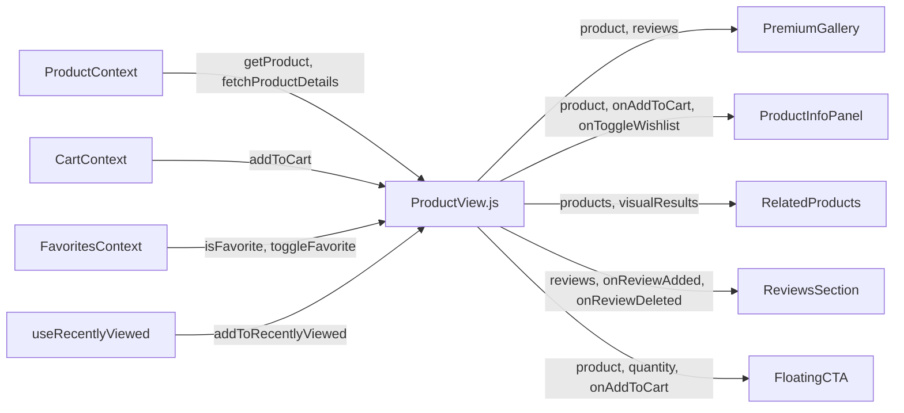

# 🏛️ Product Detail Page `/product/:id` — Premium Luxury Redesign

## 📋 Executive Summary

Complete redesign of the product detail page (`ProductView.js`) following the Net-a-Porter / Mytheresa / Farfetch luxury fashion aesthetic. The current page has all necessary functionality but lacks the visual refinement, spatial hierarchy, and immersive feel of a true luxury e-commerce experience.

---

## 🔍 Current State Analysis

### Active File
- **[`ProductView.js`](client/src/pages/ProductView.js)** — 659 lines, currently served via [`App.js`](client/src/App.js:163) route

### Existing Redesign Attempt
- **[`RedesignedProductView.js`](client/src/components/ProductView/RedesignedProductView.js)** — 529 lines, NOT currently used in routing

### Key Issues with Current Implementation

| # | Issue | Location |
|---|-------|----------|
| 1 | Images rendered as flat scrollable list — no carousel interaction | Line 265-275 |
| 2 | Right panel has 15+ sections stacked vertically — key CTAs hidden below fold | Line 279-520 |
| 3 | No wishlist toggle — just a static Heart button | Line 425-427 |
| 4 | No share functionality | Missing |
| 5 | No PriceDropAlert integration | Missing |
| 6 | Trust features too small and easy to miss | Line 431-444 |
| 7 | Craftsmanship section feels disconnected | Line 475-520 |
| 8 | Related products lack visual impact | Line 534-585 |
| 9 | Reviews section layout is basic | Line 630-649 |
| 10 | No sticky/floating CTA on mobile scroll | Missing |

### Design System Reference

```
Background:    #0a0a0b (primary) | #141416 (secondary) | #1c1c1f (elevated)
Gold Accent:   #c9a96e | hover: #d4b87a | subtle: rgba(201,169,110,0.12)
Text:          #f5f5f3 (primary) | #8a8a8d (secondary) | #6b6b6e (muted)
Border:        rgba(255,255,255,0.08) | hover: rgba(255,255,255,0.15)
Font:          Inter (body) | Brilliant (display headings)
Radius:        6px / 10px / 14px / 20px / 28px
```

---

## 🎯 Design Philosophy: Haute Couture Digital Experience

Inspired by **Net-a-Porter**, **Mytheresa**, **Farfetch**, and **SSENSE**:

1. **Typography-first** — Large, elegant headings with generous whitespace
2. **Immersive imagery** — Full-bleed gallery with smooth transitions
3. **Floating purchase panel** — Always-accessible CTA that follows the user
4. **Progressive disclosure** — Information revealed elegantly as user scrolls
5. **Micro-interactions** — Subtle hover effects, smooth transitions, refined animations
6. **Everything visible** — No hidden/collapsed content, all sections open and beautifully spaced

---

## 📐 New Page Architecture

```mermaid
graph TD
    A[ProductView Page] --> B[Hero Section - Full Width]
    A --> C[Main Content Grid - 2 Column]
    A --> D[Below Grid Sections]
    
    B --> B1[Breadcrumb Navigation]
    B --> B2[Back Button + Badge]
    
    C --> E[Left: Immersive Gallery - 50%]
    C --> F[Right: Purchase Panel - 50% Sticky]
    
    E --> E1[Main Image - aspect 3/4 with zoom on hover]
    E --> E2[Thumbnail Strip - horizontal scroll]
    E --> E3[Full-screen lightbox on click]
    
    F --> F1[Category Label - gold uppercase]
    F --> F2[Product Title - Brilliant font large]
    F --> F3[Rating Stars + Review Count - clickable]
    F --> F4[Price Block - with discount badge]
    F --> F5[Description - clean prose]
    F --> F6[Color Selector - elegant swatches]
    F --> F7[Size Selector - with size guide link]
    F --> F8[Quantity + Add to Cart + Wishlist + Share]
    F --> F9[Trust Badges - delivery, warranty, returns]
    F --> F10[Installment Calculator - conditional]
    F --> F11[Flash Sale Timer - conditional]
    F --> F12[Materials and Eco Score]
    
    D --> G[Customer Photo Reviews Section]
    D --> H[Related Products Carousel]
    D --> I[AI Visual Similar Section]
    D --> J[Reviews and Ratings Section]
    
    F --> F13[Floating CTA Bar - appears on scroll]
```



---

## 📐 Detailed Layout Wireframe

### Desktop Layout (lg and above)

```
┌──────────────────────────────────────────────────────────────────┐
│  ← Katalog  /  Kategoriya  /  Product Name                      │
├──────────────────────────────┬───────────────────────────────────┤
│                              │                                   │
│                              │   KATEGORIYA                      │
│                              │                                   │
│                              │   Product Name in                 │
│    ┌──────────────────┐     │   Brilliant Font Large             │
│    │                  │     │                                   │
│    │                  │     │   ★★★★☆ 4.5  •  12 sharh          │
│    │   Main Image     │     │                                   │
│    │   aspect-[3/4]   │     │   1 200 000 so'm                  │
│    │   hover zoom     │     │   1 500 000 so'm  -20%            │
│    │   click = lightbox│    │                                   │
│    │                  │     │   Description text goes here...    │
│    │                  │     │                                   │
│    └──────────────────┘     │   ── Rang tanlang ──              │
│                              │   ⚫ ⚪ 🔵  (selected name)       │
│    ┌──┐ ┌──┐ ┌──┐ ┌──┐     │                                   │
│    │01│ │02│ │03│ │04│     │   ── Olcham tanlang ──  [Jadval]  │
│    └──┘ └──┘ └──┘ └──┘     │   [S] [M] [L] [XL]               │
│    thumbnail strip           │                                   │
│                              │   [- 1 +]     Jami: 1 200 000    │
│                              │                                   │
│                              │   [🛒 Savatga qoshish]  [♡] [↗] │
│                              │                                   │
│                              │   🚚 3-6 soat  🛡 Kafolat  🔄 7kun│
│                              │                                   │
│                              │   📦 Muddatli tolov: 4 x 300k    │
│                              │   🧵 Materiallar: Ipak, Paxta    │
│                              │   🌿 Eco: 8/10                    │
│                              │                                   │
├──────────────────────────────┴───────────────────────────────────┤
│                                                                  │
│  ── Mijozlarimiz nigohida ──                                     │
│  [Photo 1]  [Photo 2]  [Photo 3]  [Photo 4]                     │
│                                                                  │
├──────────────────────────────────────────────────────────────────┤
│                                                                  │
│  ── Sizga yoqishi mumkin ──                    [AI Oхshашlar]   │
│  ┌─────┐  ┌─────┐  ┌─────┐  ┌─────┐                           │
│  │     │  │     │  │     │  │     │                            │
│  │ img │  │ img │  │ img │  │ img │                            │
│  │     │  │     │  │     │  │     │                            │
│  └─────┘  └─────┘  └─────┘  └─────┘                            │
│  Name      Name      Name      Name                             │
│  Price     Price     Price     Price                            │
│                                                                  │
├──────────────────────────────────────────────────────────────────┤
│                                                                  │
│  ── Mijozlar fikri ──                                            │
│  ┌──────────────┐  ┌──────────────────────────────────┐         │
│  │ 4.5 ★★★★☆   │  │                                  │         │
│  │ 12 ta sharh  │  │  Review List                     │         │
│  │              │  │  ...                             │         │
│  │ [Review Form]│  │                                  │         │
│  └──────────────┘  └──────────────────────────────────┘         │
│                                                                  │
└──────────────────────────────────────────────────────────────────┘

┌──────────────────────────────────────────────────────────────────┐
│  [Floating CTA Bar - appears when main CTA scrolls out of view]  │
│  Product Name...  1 200 000 so'm  [- 1 +]  [Savatga qoshish]    │
└──────────────────────────────────────────────────────────────────┘
```

---

## 🧩 Component Breakdown — Implementation Steps

### Step 1: Create New Premium Image Gallery Component
**File**: `client/src/components/ProductView/PremiumGallery.js`

A completely new gallery component replacing the simple image list:

- **Main image**: `aspect-[3/4]`, `rounded-2xl`, hover zoom effect using CSS `transform: scale(1.5)` with `overflow-hidden` and `transform-origin` tracking mouse position
- **Thumbnail strip**: Horizontal scrollable row of small thumbnails below main image, with gold ring indicator on active
- **Navigation arrows**: Appear on hover, semi-transparent with backdrop blur
- **Image counter**: Bottom-right pill showing "1/5"
- **Click to lightbox**: Reuse existing `ImageCarousel` full-screen modal logic
- **Smooth crossfade**: CSS transition between image changes
- **Keyboard navigation**: Arrow keys when gallery is focused

### Step 2: Create Floating CTA Bar Component
**File**: `client/src/components/ProductView/FloatingCTA.js`

A sticky bottom bar that appears when the main Add to Cart button scrolls out of viewport:

- Uses `IntersectionObserver` to detect when main CTA leaves viewport
- Slides up from bottom with smooth animation
- Shows: Product name (truncated), price, quantity selector, Add to Cart button
- Background: `backdrop-blur-xl bg-[#0a0a0b]/90 border-t border-white/5`
- Disappears when user scrolls back up to main CTA

### Step 3: Create Premium Product Info Panel
**File**: `client/src/components/ProductView/ProductInfoPanel.js`

The right-side sticky panel with all product information:

- **Category label**: `text-[11px] uppercase tracking-[0.3em] text-[#c9a96e] font-semibold`
- **Product title**: `text-3xl lg:text-4xl font-brilliant text-[#f5f5f3] leading-[1.15]`
- **Rating block**: Stars + numeric rating + clickable review count that scrolls to reviews
- **Price block**: Large price with optional strikethrough original + percentage badge
- **Description**: Clean prose with `text-[#8a8a8d] leading-relaxed`
- **Color selector**: Elegant swatches with gold ring on selection + selected name display
- **Size selector**: Pill buttons with size guide link, gold highlight on selection
- **Quantity + Actions row**: Quantity stepper, Add to Cart (gold, full width), Wishlist toggle, Share button
- **Trust badges**: 3-column grid with icons + short labels
- **Conditional sections**: Installment calculator, Flash sale timer, Materials, Eco score

### Step 4: Create Enhanced Related Products Section
**File**: `client/src/components/ProductView/RelatedProducts.js`

- Section header with gold accent line
- 4-column grid of product cards
- AI Visual Similar button with sparkle icon
- Each card: `aspect-[3/4]` image, category label, name, price
- Hover: image scale + gold name color transition
- Staggered fade-in animation on scroll

### Step 5: Create Premium Reviews Section
**File**: `client/src/components/ProductView/ReviewsSection.js`

- Left column: Large rating number + stars + review count + ReviewForm in card
- Right column: ReviewList in scrollable container
- Section header with gold underline accent
- Smooth scroll-to-reviews when clicking review count in info panel

### Step 6: Rewrite Main ProductView.js
**File**: `client/src/pages/ProductView.js`

Complete rewrite composing all new sub-components:

```
Imports: All new components + existing contexts/hooks
State: Same product data flow, reviews, visual search
Layout:
  1. SEO + Helmet (structured data) — keep existing
  2. Breadcrumb navigation — enhanced
  3. Two-column grid (PremiumGallery | ProductInfoPanel)
  4. CustomerPhotoReviews section
  5. RelatedProducts section
  6. AI Visual Similar section
  7. ReviewsSection
  8. FloatingCTA (desktop only)
  9. SizeGuideModal
```

### Step 7: Add New CSS Animations
**File**: `client/src/index.css`

Add premium animations:
- `animate-image-zoom`: Smooth zoom on hover for gallery
- `animate-float-cta`: Slide-up for floating CTA bar
- `animate-section-reveal`: Staggered reveal for below-fold sections
- `animate-price-pulse`: Subtle pulse when discount is shown
- `animate-gallery-crossfade`: Smooth opacity transition between images

### Step 8: Update Mobile Product View
**File**: `client/src/pages/mobile/MobileProductView.js`

Apply the same premium design language to mobile:
- Full-width image gallery with swipe
- Sticky bottom CTA bar
- Clean info section below gallery
- Same section ordering as desktop

---

## 🎨 Visual Design Specifications

### Spacing System
```
Section gaps:        96px (mt-24)
Sub-section gaps:    32px (space-y-8)
Inner spacing:       24px (p-6)
Element gaps:        16px (gap-4)
Micro gaps:          8px (gap-2)
```

### Typography Scale
```
Product title:       text-3xl lg:text-[44px] font-brilliant leading-[1.1]
Section headings:    text-2xl lg:text-3xl font-brilliant
Category label:      text-[11px] uppercase tracking-[0.3em] font-semibold
Price:               text-[28px] font-bold tracking-tight
Body text:           text-base text-[#8a8a8d] leading-relaxed
Labels:              text-[11px] uppercase tracking-[0.2em] font-bold
Badges:              text-[10px] uppercase tracking-[0.15em] font-bold
```

### Color Usage
```
Primary actions:     bg-[#c9a96e] text-[#0a0a0b] (gold)
Secondary actions:   bg-[#141416] text-[#f5f5f3] border-white/5
Active states:       ring-2 ring-[#c9a96e] ring-offset-2 ring-offset-[#0a0a0b]
Section dividers:    border-t border-white/5
Card backgrounds:    bg-[#141416] or bg-white/[0.02]
Hover effects:       scale, translate, color transitions (200-300ms)
```

### Animation Specifications
```
Page load:           Staggered fadeInUp (0.6s cubic-bezier(0.16, 1, 0.3, 1))
Image hover:         scale(1.02) over 700ms ease
Button hover:        translateY(-1px) + shadow increase over 150ms
Section reveal:      translateY(30px) -> 0, opacity 0 -> 1 over 600ms
Gallery transition:  opacity crossfade 300ms ease
Floating CTA:        translateY(100%) -> 0 over 400ms cubic-bezier(0.16, 1, 0.3, 1)
```

---

## 📁 Files to Create/Modify

| # | File | Action | Description |
|---|------|--------|-------------|
| 1 | `client/src/components/ProductView/PremiumGallery.js` | CREATE | New immersive image gallery with zoom, thumbnails, lightbox |
| 2 | `client/src/components/ProductView/FloatingCTA.js` | CREATE | Sticky bottom CTA bar with IntersectionObserver |
| 3 | `client/src/components/ProductView/ProductInfoPanel.js` | CREATE | Complete right-side info panel with all selectors and actions |
| 4 | `client/src/components/ProductView/RelatedProducts.js` | CREATE | Enhanced related products + AI similar section |
| 5 | `client/src/components/ProductView/ReviewsSection.js` | CREATE | Premium reviews layout with form and list |
| 6 | `client/src/pages/ProductView.js` | REWRITE | Main page composing all new sub-components |
| 7 | `client/src/index.css` | MODIFY | Add new premium animations |
| 8 | `client/src/pages/mobile/MobileProductView.js` | MODIFY | Apply premium design to mobile view |

---

## 🔧 Technical Implementation Notes

### State Management
- Keep existing `useProducts`, `useCart`, `useRecentlyViewed` hooks
- Add `useFavorites` for wishlist toggle functionality
- Keep review state management (fetch, add, delete)
- Keep visual search state and API integration

### Performance Considerations
- Lazy load below-fold sections with `IntersectionObserver`
- Use `loading="lazy"` on all images except first gallery image
- Memoize expensive computations (related products filter, visual search)
- Use CSS transforms for animations (GPU accelerated)
- Debounce gallery zoom mouse tracking

### Accessibility
- All interactive elements keyboard accessible
- Proper ARIA labels on gallery navigation
- Focus management in lightbox modal
- Color contrast meets WCAG AA standards
- Screen reader friendly price and rating announcements

### SEO Preservation
- Keep all existing `SEO` component props
- Keep `Helmet` structured data (Product schema)
- Keep breadcrumb structured data
- Keep canonical URL

---

## 📊 Component Data Flow



---

## ✅ Implementation Order

1. **PremiumGallery.js** — The most impactful visual change
2. **ProductInfoPanel.js** — Core purchase experience
3. **Rewrite ProductView.js** — Compose gallery + info panel
4. **FloatingCTA.js** — Conversion optimization
5. **RelatedProducts.js** — Cross-selling section
6. **ReviewsSection.js** — Social proof section
7. **CSS animations** — Polish and micro-interactions
8. **MobileProductView.js** — Mobile parity

Each step is independently testable — the page will work after step 3 with basic functionality, and steps 4-8 enhance it progressively.
