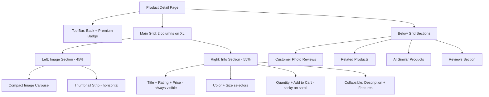
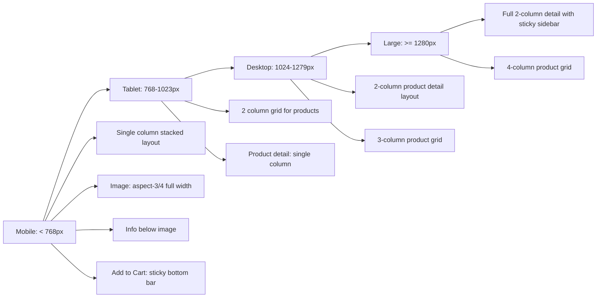

# 🏗️ Products & Product Detail Redesign Plan

## 📋 Executive Summary

Redesign the `/products` listing page and `/product/:id` detail page for the Luxx.uz premium luxury women's fashion website. The main issues are:

1. **Product detail image is too large** — forces users to scroll to see product info
2. **Right-side panel overflows** — description, title, colors, sizes, and actions are hidden below the fold
3. **Listing page needs refinement** — better visual hierarchy and premium feel

---

## 🔍 Current State Analysis

### Files Involved

| File | Purpose | Lines |
|------|---------|-------|
| `client/src/pages/AllProducts.js` | Products listing page | 346 |
| `client/src/pages/ProductView.js` | Product detail page | 708 |
| `client/src/components/ProductHero.js` | Listing hero banner | 79 |
| `client/src/components/PremiumProductCard.js` | Product card component | 141 |
| `client/src/components/ImageCarousel.js` | Product image gallery | 206 |
| `client/src/components/QuickViewModal.js` | Quick view modal | 351 |
| `client/src/components/FilterDrawer.js` | Filter sidebar drawer | 118 |
| `client/src/index.css` | Global styles | 1215 |

### Current Design System

- **Background**: `#0a0a0b` primary, `#141416` secondary
- **Gold Accent**: `#c9a96e` / `#d4b87a`
- **Text**: `#f5f5f3` primary, `#8a8a8d` secondary, `#6b6b6e` muted
- **Border**: `rgba(255,255,255,0.08)`
- **Font**: Inter + Brilliant for display headings

---

## 🐛 Identified Problems

### Problem 1: Product Detail Image Too Large

**File**: `ProductView.js` line 325-367

```
Current layout: grid grid-cols-1 gap-8 xl:grid-cols-[1.07fr_0.93fr]
Image container: aspect-[4/5] inside ImageCarousel
```

The image column uses `1.07fr` giving it MORE space than the info panel. The `aspect-[4/5]` ratio creates a very tall image. Below the image there are 3 extra info cards adding more vertical space.

### Problem 2: Right Panel Content Overflow

**File**: `ProductView.js` line 369-576

The right aside contains ALL of these stacked vertically:
- Premium badge
- Product title
- Rating + review count
- Price
- Description
- Color selector
- Size selector + size guide button
- Quantity selector
- Subtotal
- Add to Cart button
- Trust note
- 3 feature cards (delivery, warranty, returns)
- Back in Stock button
- Installment Calculator
- Flash Sale Timer
- Price Drop Alert

This is ~15+ UI sections stacked vertically, making it impossible to see key actions without scrolling.

### Problem 3: Listing Page Visual Hierarchy

The hero section takes significant vertical space. The grid layout is functional but could be more premium.

---

## 🎯 Redesign Architecture

### Part A: Product Detail Page `/product/:id` — CRITICAL PRIORITY

#### A1. New Layout Structure



#### A2. Specific Changes to `ProductView.js`

**Layout Grid** (line 325):
```
BEFORE: grid-cols-1 gap-8 xl:grid-cols-[1.07fr_0.93fr]
AFTER:  grid-cols-1 gap-6 lg:grid-cols-[2fr_3fr]
```
- Switch to `lg:` breakpoint instead of `xl:` so 2-column kicks in earlier
- Give info panel 60% of space, image 40%
- Reduce gap from 8 to 6

**Image Section** (line 326-367):
- Remove the outer article wrapper with excessive padding and gradients
- Remove the 3 info cards below the image (Category, Selection, Rating) — move this data to the right panel
- Change image aspect ratio from `4/5` to `3/4` in ImageCarousel
- Remove the "Editorial Preview" badge — redundant with the right panel badge

**Right Panel Restructure** (line 369-576):

Split into 3 zones:

| Zone | Content | Behavior |
|------|---------|----------|
| **Zone 1 - Always Visible** | Badge, Title, Rating, Price, Category | Static |
| **Zone 2 - Core Actions** | Color picker, Size picker, Quantity, Add to Cart | Sticky on desktop |
| **Zone 3 - Expandable** | Description, Features, Installment, Flash Sale, Price Drop | Collapsible accordion |

**Key Change**: Make Zone 2 sticky so the Add to Cart button is always accessible:
```
className="xl:sticky xl:top-24 xl:self-start xl:max-h-[calc(100vh-6rem)] xl:overflow-y-auto"
```

#### A3. Changes to `ImageCarousel.js`

- Change aspect ratio from `aspect-[4/5]` to `aspect-[3/4]` on line 142
- This reduces image height by ~15%
- Add thumbnail strip below the main image for navigation
- Keep the fullscreen modal functionality

#### A4. Collapsible Sections Pattern

Create a simple accordion pattern for secondary info:

```jsx
// Pseudocode for collapsible section
const CollapsibleSection = ({ title, icon, children, defaultOpen = false }) => {
  const [isOpen, setIsOpen] = useState(defaultOpen);
  return (
    <div className="border-b border-white/5">
      <button onClick={() => setIsOpen(!isOpen)} className="flex w-full items-center justify-between py-3">
        <span>{icon} {title}</span>
        <ChevronDown className={`transition-transform ${isOpen ? 'rotate-180' : ''}`} />
      </button>
      {isOpen && <div className="pb-4">{children}</div>}
    </div>
  );
};
```

Sections to make collapsible:
1. **Tavsif** (Description) — default open
2. **Yetkazib berish** (Delivery info) — default closed
3. **Muddatli tolov** (Installment) — default closed
4. **Narx tushishi** (Price Drop Alert) — default closed

---

### Part B: Products Listing Page `/products`

#### B1. Compact Hero Section

**File**: `ProductHero.js`

Reduce the hero from a full-screen section to a compact elegant header:

```
BEFORE: pt-24 pb-16 with large animated backgrounds and scroll indicator
AFTER:  pt-20 pb-8 with subtle gradient and no scroll indicator
```

- Remove the 3 animated background blobs — replace with a single subtle gradient
- Remove the scroll indicator at the bottom
- Reduce title from `text-7xl` to `text-5xl lg:text-6xl`
- Keep stats but make them inline with the title
- Remove the bottom gradient fade

#### B2. Enhanced Filter Bar

**File**: `AllProducts.js` lines 137-227

The filter bar is already well-designed. Minor improvements:
- Add a product count indicator on the left side
- Improve the active category pill animation
- Add a subtle divider between filter bar and grid

#### B3. PremiumProductCard Enhancement

**File**: `PremiumProductCard.js`

Minor refinements:
- Add a subtle border on hover with gold glow
- Improve the "Sotib olish" button animation
- Better price display with discount percentage badge

#### B4. Grid Layout

```
BEFORE: grid grid-cols-2 md:grid-cols-3 lg:grid-cols-4 gap-4 md:gap-5 lg:gap-6
AFTER:  grid grid-cols-2 md:grid-cols-3 lg:grid-cols-4 gap-3 md:gap-4 lg:gap-5
```

Slightly tighter gaps for a more editorial feel.

---

### Part C: QuickViewModal Updates

**File**: `QuickViewModal.js`

- Ensure modal matches the new design language
- Reduce image section height from `md:min-h-[500px]` to `md:min-h-[400px]`
- Make info section more compact

---

## 📐 Responsive Breakpoints Strategy



### Mobile-Specific: Sticky Add to Cart Bar

On mobile, add a fixed bottom bar with price + add to cart button that appears when the user scrolls past the main Add to Cart button:

```jsx
// Only visible on mobile when scrolled past main CTA
<div className="fixed bottom-0 left-0 right-0 z-40 p-4 bg-[#0a0a0b]/95 backdrop-blur-xl border-t border-white/10 md:hidden">
  <div className="flex items-center gap-4">
    <span className="text-lg font-bold">{formatPrice(product.price)} so'm</span>
    <button className="flex-1 py-3 rounded-xl bg-[#f4f1eb] text-[#0f1014] font-bold">
      Savatga qo'shish
    </button>
  </div>
</div>
```

---

## 📁 Files to Modify

| # | File | Change Type | Priority |
|---|------|-------------|----------|
| 1 | `client/src/pages/ProductView.js` | Major restructure | 🔴 Critical |
| 2 | `client/src/components/ImageCarousel.js` | Aspect ratio change | 🔴 Critical |
| 3 | `client/src/pages/AllProducts.js` | Minor refinements | 🟡 Medium |
| 4 | `client/src/components/ProductHero.js` | Compact redesign | 🟡 Medium |
| 5 | `client/src/components/QuickViewModal.js` | Minor updates | 🟢 Low |
| 6 | `client/src/components/PremiumProductCard.js` | Minor polish | 🟢 Low |
| 7 | `client/src/index.css` | New utility styles | 🟡 Medium |

---

## 🔄 Implementation Order

1. **ProductView.js** — Fix the critical layout issue with image size and content overflow
2. **ImageCarousel.js** — Reduce aspect ratio for better proportions
3. **ProductHero.js** — Make the hero section more compact
4. **AllProducts.js** — Minor listing page refinements
5. **QuickViewModal.js** — Match new design language
6. **PremiumProductCard.js** — Visual polish
7. **index.css** — Add any new utility classes needed

---

## ⚠️ Things to Preserve

- All existing functionality (cart, reviews, comparison, quick view)
- SEO setup with Helmet and structured data
- All existing components (SizeGuideModal, InstallmentCalculator, FlashSaleTimer, etc.)
- The premium dark theme color palette
- Responsive design approach
- Animation and transition patterns
